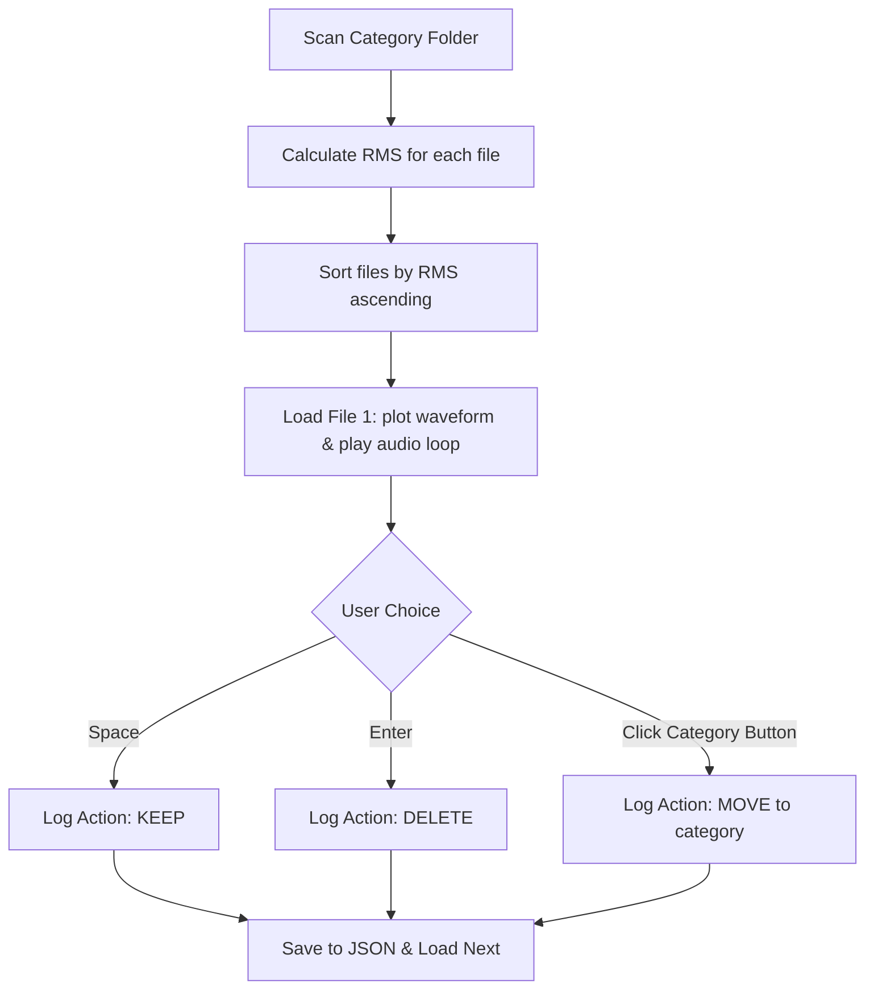

# PyTorch Keyword Detection Model Documentation

This document provides an exhaustive, historically accurate, and highly technical overview of the PyTorch-based Keyword Detection model in this repository. It covers the project goals, dataset sourcing and curation, validation mechanisms, optimizations to resolve system bottlenecks, progressive engineering iterations, the final CNN model architecture, and post-processing inference filters.

---

## 1. Project Goal
The primary objective of this project is to build a highly accurate, real-time, low-latency spoken keyword detection model. The model classifies short (1-second) audio inputs into one of the following five categories:
* `yes`
* `no`
* `up`
* `down`
* `other` (noise, silence, background sound, or other spoken words)

The target classification categories are designed to feed directly into the companion web application's **Voice Arcade** to control games via voice commands (e.g., jumping in *Flappy Bird*, navigating in *Grid Runner*, firing/shielding in *Space Defender*, playing sequence memory in *Simon*, or guessing in *Cyber Hi-Lo*).

---

## 2. Dataset Sourcing & Curation

### 2.1 Sourcing
The raw data is sourced from the Google Speech Commands dataset (v2), containing isolated spoken words. The dataset is downloaded via the Kaggle dataset repository `neehakurelli/google-speech-commands` (approx. 1.4 GB zip file) or loaded from a local ZIP file using the script located in [Download_Dataset.py](file:///c:/_school/KeywordDetection/install/Download_Dataset.py).

### 2.2 Restructuring Pipeline
To optimize classification performance and establish a clean directory structure, [Download_Dataset.py](file:///c:/_school/KeywordDetection/install/Download_Dataset.py) processes the extracted dataset through the following steps:
1. **Keyword Filtering:** The directory structure is scanned, and folders matching the core config keywords (`yes`, `no`, `up`, `down`) are retained in place under `dataset/`.
2. **Merging "Other" Categories:** Non-keyword directories (e.g., `bed`, `cat`, `dog`, `happy`, `house`, etc.) are moved into `dataset/other/`. To prevent filename collisions, files are renamed to prepend the original category folder name:
   $$\text{dataset/bed/00f0204f\_nohash\_0.wav} \rightarrow \text{dataset/other/bed\_00f0204f\_nohash\_0.wav}$$
3. **Background Noise Slicing:** Ambient background noise files in `_background_noise_` (e.g., `white_noise.wav`, `pink_noise.wav`, `running_tap.wav`, `doing_the_dishes.wav`) are sliced into overlapping 1-second clips to serve as negative training samples for the `other` class.
   * Number of slices per file: $\text{duration in seconds} \times 3$.
   * Special exception: `doing_the_dishes.wav` is sliced into exactly 270 clips.
   * The sliced clips are converted to mono (by averaging channels) and saved in `dataset/other/` as `background_noise_X_filename.wav`.
4. **README Deletion:** A recursive cleanup is run to delete all `README.md` files from the dataset directory to prevent notebook ingestion issues.

The core Python logic responsible for background noise slicing is implemented as follows:
```python
# Slicing background noise files into overlapping 1s segments
for idx, src in enumerate(noise_files_to_process, 1):
    filename = os.path.basename(src)
    try:
        data, sr = sf.read(src)
        # Convert stereo to mono
        if len(data.shape) > 1:
            data = data[:, 0]

        N = len(data)
        time_in_seconds = N / sr
        num_clips = int(time_in_seconds * 3)
        # Special override for doing_the_dishes.wav
        if "doing_the_dishes" in filename.lower():
            num_clips = 270

        # Extract exactly num_clips overlapping 1-second clips
        if N > sr:
            if num_clips > 1:
                start_indices = [int(j * (N - sr) / (num_clips - 1)) for j in range(num_clips)]
            else:
                start_indices = [0]
            for clip_num, start_idx in enumerate(start_indices, 1):
                clip_data = data[start_idx : start_idx + sr]
                clip_name = f"background_noise_{clip_num}_{filename}"
                dst_file = os.path.join(other_dir, clip_name)
                sf.write(dst_file, clip_data, sr)
        else:
            # Pad with zeros if shorter than 1 second
            clip_data = np.pad(data, (0, sr - N), 'constant')
            clip_name = f"background_noise_1_{filename}"
            dst_file = os.path.join(other_dir, clip_name)
            sf.write(dst_file, clip_data, sr)
```

---

## 3. Dataset Validation & Cleanup (PyQt6 GUI App)

During initial development, the dataset was found to contain empty, corrupted, silent, or mislabeled WAV files. Mislabeled files degraded classification metrics, and silent files created false positive triggers.

### 3.1 Custom PyQt6 Review Tool
To solve this without manually scanning 1.9 GB of audio, a PyQt6 GUI tool was developed: [Wav_File_Cleanup.py](file:///c:/_school/KeywordDetection/Utils/Wav%20File%20cleanup/Wav_File_Cleanup.py).



### 3.2 Key Technical Features:
* **Silent-First Sorting:** Computes the Root Mean Square (RMS) energy for each file:
  $$\text{RMS} = \sqrt{\frac{1}{N} \sum_{i=1}^{N} x_i^2}$$
  Files are sorted in ascending order of RMS energy so that silent or near-silent files are presented to the reviewer first.
* **Auto-Play Loop:** Audio is automatically loaded using `soundfile` and played in an infinite loop using `sounddevice` with volume multipliers ranging from 0.1x to 10.0x.
* **Waveform Visualization:** Real-time plotting of the wave amplitude in a `pyqtgraph.PlotWidget`.
* **State Persistence:** Logs action entries (`delete`, `keep`, or destination category) along with the current index into a JSON file: `Utils/Wav File cleanup/<category>_data.json`.
* **Keyboard Shortcuts:** Fast reviewing:
  * `Space`: Keep (`"action": "keep"`)
  * `Enter`: Delete (`"action": "delete"`)
  * `Right Arrow`: Next file
  * `Left Arrow`: Undo last action (pops from undo stack)

The review mechanism uses the following PyQt6 key event handler:
```python
def keyPressEvent(self, event):
    if event.key() == Qt.Key.Key_Space:
        self.log_action("keep")
    elif event.key() == Qt.Key.Key_Return or event.key() == Qt.Key.Key_Enter:
        self.log_action("delete")
    elif event.key() == Qt.Key.Key_Right:
        self.next_file()
    elif event.key() == Qt.Key.Key_Left:
        self.undo()
```

### 3.3 Pipeline Integration
The [Download_Dataset.py](file:///c:/_school/KeywordDetection/install/Download_Dataset.py) script checks for the presence of these `_data.json` logs. If the user chooses to "cleanup" the dataset, it automatically applies these actions:
* Files logged as `delete` are removed from the filesystem.
* Files logged with a target category are moved to the corresponding folder and renamed to prepend the source category name (e.g., `down/hash.wav` moved to `up/down_hash.wav`).

---

## 4. Resolving Memory & Disk I/O Bottlenecks

### 4.1 The Issue
Initially, loading WAV files from disk on-the-fly inside the PyTorch `Dataset.__getitem__` loop caused a major system bottleneck. The CPU was fully utilized (70-100%) handling disk read operations and decoding, while the GPU remained idle (average utilization ~30%), leading to slow training runs.

### 4.2 The Solution
A dynamic RAM caching strategy was implemented in the `KeywordDataset` constructor inside [PyTorch.ipynb](file:///c:/_school/KeywordDetection/PyTorch/PyTorch.ipynb):

1. **Pre-loading Waveforms:** All waveforms are read, decoded, and stored in a list `self.waveforms` in memory during dataset initialization:
   ```python
   self.waveforms = []
   for path in paths:
       waveform_np, sr = sf.read(os.path.normpath(path), dtype="float32")
       waveform = torch.from_numpy(waveform_np)
       ...
       self.waveforms.append(waveform)
   ```
2. **Standardization at Loading:**
   * Stereo channels are averaged to mono:
     $$\text{waveform} = \frac{1}{C}\sum_{c=1}^C \text{channel}_c$$
   * Non-training set audio is center-cropped to `NUM_SAMPLES = 16000` (1 second at 16 kHz).
   * Short files are padded with zeros:
     `F.pad(waveform, (0, self.config.NUM_SAMPLES - waveform.shape[1]))`
3. **Training Data Augmentation on the Fly:** Data augmentation (like random time shifts) is applied dynamically to the cached tensor in `__getitem__`, avoiding disk reads.

**Result:** Training time per epoch dropped from minutes to under 5 seconds (on a CUDA GPU), and GPU utilization increased significantly.

---

## 5. Dataset Splitting & Balancing

### 5.1 Class Imbalance
The "other" category consists of files merged from dozens of non-keyword folders, resulting in over 56,000 files. If left unbalanced, the model would over-predict `other` due to class imbalance.

### 5.2 Split & Balance Pipeline
To resolve this, the following pipeline was integrated:
1. **"Other" Downsampling:** The `other` folder files are randomly downsampled to exactly 10,000 files:
   ```python
   downsampled_other = random.sample(other_files, min(len(other_files), 10000))
   ```
2. **Stratified 3-way Split:** A stratified split is used to divide the dataset into training (70%), validation (15%), and testing (15%) sets to ensure class proportions are identical across all sets:
   ```python
   # Split off test set (15%)
   temp_paths, test_paths, temp_labels, test_labels = train_test_split(
       initial_paths, initial_labels, test_size=0.15, stratify=initial_labels, random_state=42
   )
   # Split remaining 85% into Train (70%) and Validation (15%)
   train_paths_raw, val_paths, train_labels_raw, val_labels = train_test_split(
       temp_paths, temp_labels, test_size=0.1765, stratify=temp_labels, random_state=42
   )
   ```
   *Note: The split ratio for the second step is $\frac{15\%}{85\%} \approx 17.65\%$ to achieve exactly 15% validation and 70% training proportions from the remaining pool.*
3. **Training Oversampling:** Since keywords have fewer training samples (around 2,000 each) compared to the 7,000 training samples in `other` (70% of 10,000), keywords are oversampled in the training set to a target size of 8,000 samples each:
   ```python
   oversampled = random.choices(cls_train_files, k=8000)
   ```

The final distribution across splits displays:
```text
Balanced Dataset Split:
  - Validation set size: 2833 (stratified)
  - Test set size: 2833 (stratified)
    * yes: 8000 train, 283 val, 283 test
    * no: 8000 train, 283 val, 283 test
    * up: 8000 train, 283 val, 283 test
    * down: 8000 train, 283 val, 283 test
    * other: 7000 train, 1501 val, 1501 test
```

---

## 6. Progressive Testing Iterations (PyTorch/Testing)

The `PyTorch/Testing` directory contains 13 progressive scripts demonstrating the evolution of the model configuration and architecture. The batch runner script [run_all.py](file:///c:/_school/KeywordDetection/PyTorch/Testing/run_all.py) executes these scripts and logs results.

Below is an exhaustive breakdown of the architectural modifications introduced in each file:

### `01_specaugment.py`
* **Modification:** Integrates `torchaudio.transforms.FrequencyMasking(freq_mask_param=10)` and `TimeMasking(time_mask_param=20)` on the spectrogram features before the forward pass.
* **Accuracies:** Test accuracy reached **95.10% - 95.68%**.
* **Analysis:** Adding noise to the spectral representations during training significantly improved generalization on raw audio.

### `02_audio_data_augmentation.py`
* **Modification:** Adds dynamic time-shifting on raw waveforms by rolling the input vector:
  `torch.roll(waveform, shift, dims=-1)` where $\text{shift} \in [-1600, 1600]$ samples ($\approx \pm 100\text{ ms}$).
* **Accuracies:** Test accuracy rose to **95.52% - 96.15%**.
* **Analysis:** Shifting audio targets forces translation invariance on the convolutional kernels.

### `03_lr_scheduler.py`
* **Modification:** Integrates `optim.lr_scheduler.ReduceLROnPlateau` with `factor=0.5` and `patience=3` (monitoring validation accuracy).
* **Accuracies:** Test accuracy stabilized at **95.68%**.
* **Analysis:** Decelerating learning rate helps the optimizer escape local minima during late epochs.

### `04_batch_normalization.py`
* **Modification:** Adds `nn.BatchNorm2d` after each convolutional layer.
* **Accuracies:** Test accuracy dropped to **53.95% - 64.44%**.
* **Analysis:** The initial implementation had bugs where activations diverged due to improper weight initialization. This was corrected in subsequent versions.

### `05_weight_decay.py`
* **Modification:** Appends `weight_decay=1e-4` to the Adam optimizer configuration to enforce L2 regularization.
* **Accuracies:** Test accuracy reached **94.89% - 95.68%**.
* **Analysis:** Prevents weight explosion but does not provide significant benefits alone.

### `06_increase_filters_and_mfcc.py`
* **Modification:** Upgrades standard CNN architecture to a 4-layer CNN (16 -> 32 -> 64 -> 128 channels) and switches input from MelSpectrogram to 40-coefficient MFCC.
* **Accuracies:** Test accuracy improved to **96.79% - 97.68%**.
* **Analysis:** Higher capacity allows the network to distinguish complex phonetic boundaries.

### `07_increase_mel_bins.py`
* **Modification:** Reconfigures MFCC generation to use 128 mel bins.
* **Accuracies:** Test accuracy decreased to **89.67% - 94.47%**.
* **Analysis:** Exposes the network to excess high-frequency noise, which degrades accuracy.

### `08_increase_dropout.py`
* **Modification:** Raises the dropout probability inside the fully connected layer from 0.1 to 0.3.
* **Accuracies:** Test accuracy reached **95.52%**.
* **Analysis:** Enhances regularizing properties, minimizing co-adaptation of hidden units.

### `09_model_checkpointing.py`
* **Modification:** Saves the model weights only when validation accuracy improves.
* **Accuracies:** Test accuracy reached **95.15% - 95.42%**.
* **Analysis:** Solves overfitting at the end of training by keeping the best state.

### `10_combined_best.py`
* **Modification:** Combines the best configuration elements from iterations 1-9: time-shifting, SpecAugment, 4-layer CNN, learning rate scheduling, and checkpointing.
* **Accuracies:** Test accuracy reached **97.95%**.

### `11_combined_stable.py`
* **Modification:** Standardizes training parameters, handles stereo audio conversion, and sets up a robust early stopping threshold.
* **Accuracies:** Test accuracy reached **98.21% - 98.52%**.

### `12_confusion_matrix.py`
* **Modification:** Adds a testing script that evaluates the best saved model state against the validation/test datasets and generates a confusion matrix using `seaborn` heatmaps.
* **Accuracies:** Evaluated at **98.58%** test accuracy.

### `13_kfold_cross_validation.py`
* **Modification:** Replaces the static split with a 5-fold cross-validation loop to check generalization across the entire dataset.
* **Accuracies:** Reached a mean accuracy of **98.37%** with a standard deviation of **0.28%**.

---

## 7. Model Architecture

The final model used in this project is a 2D Convolutional Neural Network. It takes a Log-Mel Spectrogram representation of the audio waveform as input rather than raw audio or MFCCs, providing better spatial-temporal feature maps for the convolutional kernels.

### 7.1 Spectrogram Transform (`LogMelSpectrogram`)
The waveform is converted to a Log-Mel Spectrogram using the following formula:
$$\text{Log-Mel}(x) = \log(\text{MelSpectrogram}(x) + 10^{-6})$$
* **Parameters:** `sample_rate = 16000`, `n_fft = 400` ($25\text{ ms}$ window), `hop_length = 160` ($10\text{ ms}$ hop), `n_mels = 64`.
* **Input Shape:** `(Batch, 1, 16000)` $\rightarrow$ **Output Shape:** `(Batch, 1, 64, 101)`.

The PyTorch module for the transform is implemented as:
```python
class LogMelSpectrogram(nn.Module):
    def __init__(self, sample_rate, n_fft=400, hop_length=160, n_mels=64):
        super().__init__()
        self.mel = torchaudio.transforms.MelSpectrogram(
            sample_rate=sample_rate,
            n_fft=n_fft,
            hop_length=hop_length,
            n_mels=n_mels
        )

    def forward(self, x):
        x = self.mel(x)
        return torch.log(x + 1e-6)
```

### 7.2 Neural Network Diagram & Layer Dimensions
```
Input: Log-Mel Spectrogram (Batch, 1, 64, 101)
  │
  ├──► Conv2D (1->16, 3x3, pad 1) ──► BN2D ──► ReLU ──► MaxPool (2x2) ──► Dropout (0.3)
  │    Output Shape: (Batch, 16, 32, 50)
  │
  ├──► Conv2D (16->32, 3x3, pad 1) ──► BN2D ──► ReLU ──► MaxPool (2x2) ──► Dropout (0.3)
  │    Output Shape: (Batch, 32, 16, 25)
  │
  ├──► Conv2D (32->64, 3x3, pad 1) ──► BN2D ──► ReLU ──► MaxPool (2x2) ──► Dropout (0.3)
  │    Output Shape: (Batch, 64, 8, 12)
  │
  ├──► Conv2D (64->128, 3x3, pad 1) ──► BN2D ──► ReLU ──► MaxPool (2x2) ──► Dropout (0.3)
  │    Output Shape: (Batch, 128, 4, 6)
  │
  ├──► AdaptiveAvgPool2d (4x4)
  │    Output Shape: (Batch, 128, 4, 4)
  │
  ├──► Flatten (Batch, 2048)
  │
  ├──► Linear (2048 -> 128) ──► ReLU ──► Dropout (0.3)
  │
  └──► Linear (128 -> Num_Classes) ──► Output Logits
```

The mathematical computation for the output size of a 2D convolutional layer is given by:
$$W_{out} = \left\lfloor \frac{W_{in} - K + 2P}{S} \right\rfloor + 1$$
Where:
* $W_{in}$ is the input width/height.
* $K$ is the kernel size ($3$).
* $P$ is the padding ($1$).
* $S$ is the stride ($1$).

Since $K=3, P=1, S=1$, the convolutional layers preserve spatial dimensions:
$$W_{out} = \left\lfloor \frac{W_{in} - 3 + 2}{1} \right\rfloor + 1 = W_{in}$$

Spatial downsampling is handled by the Max Pooling layers (`kernel_size=2`, `stride=2`):
$$W_{pool} = \left\lfloor \frac{W_{in}}{2} \right\rfloor$$
This halves the width and height at each stage (truncating fractions).

The complete `KeywordCNN` class is defined as follows:
```python
class KeywordCNN(nn.Module):
    def __init__(self, num_classes):
        super(KeywordCNN, self).__init__()
        self.conv1 = nn.Conv2d(1, 16, kernel_size=3, padding=1)
        self.bn1 = nn.BatchNorm2d(16)
        
        self.conv2 = nn.Conv2d(16, 32, kernel_size=3, padding=1)
        self.bn2 = nn.BatchNorm2d(32)
        
        self.conv3 = nn.Conv2d(32, 64, kernel_size=3, padding=1)
        self.bn3 = nn.BatchNorm2d(64)
        
        self.conv4 = nn.Conv2d(64, 128, kernel_size=3, padding=1)
        self.bn4 = nn.BatchNorm2d(128)

        self.pool = nn.MaxPool2d(2, 2)
        self.dropout = nn.Dropout(0.3)
        self.adaptive_pool = nn.AdaptiveAvgPool2d((4, 4))

        self.fc1 = nn.Linear(128 * 4 * 4, 128)
        self.fc2 = nn.Linear(128, num_classes)

    def forward(self, x):
        x = self.pool(F.relu(self.bn1(self.conv1(x))))
        x = self.pool(F.relu(self.bn2(self.conv2(x))))
        x = self.pool(F.relu(self.bn3(self.conv3(x))))
        x = self.pool(F.relu(self.bn4(self.conv4(x))))
        x = self.adaptive_pool(x)
        x = torch.flatten(x, 1)
        x = self.dropout(F.relu(self.fc1(x)))
        logits = self.fc2(x)
        return logits
```

---

## 8. Training Details
* **Loss Function:** Cross-Entropy Loss:
  $$\mathcal{L} = -\sum_{c=1}^{C} y_c \log(\hat{y}_c)$$
* **Optimizer:** Adam ($\beta_1 = 0.9, \beta_2 = 0.999$, learning rate $\eta = 0.001$).
* **LR Scheduler:** `ReduceLROnPlateau` (factor=0.5, patience=5 epochs, monitoring validation accuracy).
* **Early Stopping:** Stops training if validation accuracy does not improve for 15 consecutive epochs.
* **Generalization Check:** 5-Fold Cross Validation confirmed generalization with a mean accuracy of **98.37%** and a low standard deviation of **0.28%**.

The training loop from `PyTorch.ipynb` is structured as follows:
```python
def train_model(config, patience=15):
    train_loader = DataLoader(KeywordDataset(train_paths, train_labels, config, is_training=True), 
                              batch_size=config.BATCH_SIZE, shuffle=True, num_workers=0, pin_memory=True)
    val_loader = DataLoader(KeywordDataset(val_paths, val_labels, config, is_training=False), 
                            batch_size=config.BATCH_SIZE, shuffle=False, num_workers=0, pin_memory=True)
    test_loader = DataLoader(KeywordDataset(test_paths, test_labels, config, is_training=False), 
                             batch_size=config.BATCH_SIZE, shuffle=False, num_workers=0, pin_memory=True)

    model = KeywordCNN(num_classes=len(config.CLASSES)).to(config.DEVICE)
    criterion = nn.CrossEntropyLoss()
    optimizer = optim.Adam(model.parameters(), lr=config.LEARNING_RATE)
    scheduler = optim.lr_scheduler.ReduceLROnPlateau(optimizer, mode='max', factor=0.5, patience=config.SCHEDULER_PATIENCE)

    mfcc_transform = LogMelSpectrogram(
        sample_rate=config.TARGET_SAMPLE_RATE, n_fft=400, hop_length=160, n_mels=64
    ).to(config.DEVICE)
    
    freq_masking = torchaudio.transforms.FrequencyMasking(freq_mask_param=10).to(config.DEVICE)
    time_masking = torchaudio.transforms.TimeMasking(time_mask_param=20).to(config.DEVICE)

    best_acc = 0.0
    best_model_wts = copy.deepcopy(model.state_dict())
    early_stop_counter = 0

    history = {
        'train_loss': [], 'val_loss': [],
        'train_acc': [],  'val_acc': []
    }

    print(f"Training on {config.DEVICE}...")

    for epoch in range(config.EPOCHS):
        start_time = time.time()
        model.train()
        total_loss, correct, total = 0, 0, 0

        for batch_idx, (inputs, targets) in enumerate(train_loader):
            inputs, targets = inputs.to(config.DEVICE), targets.to(config.DEVICE)
            with torch.no_grad():
                inputs = mfcc_transform(inputs)
                inputs = freq_masking(inputs)
                inputs = time_masking(inputs)

            optimizer.zero_grad()
            outputs = model(inputs)
            loss = criterion(outputs, targets)
            loss.backward()
            optimizer.step()

            total_loss += loss.item()
            _, predicted = outputs.max(1)
            total += targets.size(0)
            correct += predicted.eq(targets).sum().item()

        train_acc = 100. * correct / total
        train_loss = total_loss / len(train_loader)

        # Evaluate on validation split
        val_avg_loss, val_acc, _, _ = evaluate_model(model, val_loader, mfcc_transform, criterion, config.DEVICE)
        
        # Save logs
        history['train_loss'].append(train_loss)
        history['val_loss'].append(val_avg_loss)
        history['train_acc'].append(train_acc)
        history['val_acc'].append(val_acc)

        dur = time.time() - start_time
        print(f"Epoch {epoch+1}/{config.EPOCHS} [{dur:.1f}s] | Train Acc: {train_acc:.2f}% | Val Acc: {val_acc:.2f}%")

        if val_acc > best_acc:
            best_acc = val_acc
            best_model_wts = copy.deepcopy(model.state_dict())
            early_stop_counter = 0
        else:
            early_stop_counter += 1
            if early_stop_counter >= patience:
                print(f"Early stopping at epoch {epoch+1}")
                break
        scheduler.step(val_acc)

    model.load_state_dict(best_model_wts)
    
    # Final validation on unseen test set
    test_loss, test_acc, _, _ = evaluate_model(model, test_loader, mfcc_transform, criterion, config.DEVICE, use_filters=True)
    print(f"\nFinal Unbiased Test Accuracy: {test_acc:.2f}% (Loss: {test_loss:.4f})")
    
    return model, history, mfcc_transform
```

---

## 9. Inference Filters (VAD & Confidence Overrides)

In real-time environments, background noise or quiet breathing can cause false triggers. To prevent this, the evaluation and inference pipeline incorporates two post-processing filters:

### 9.1 Voice Activity Detection (VAD)
Computes the RMS energy of the raw 1-second audio buffer. If it falls below a threshold, it is classified as silence:
$$\text{RMS} = \sqrt{\frac{1}{N}\sum_{i=1}^N x_i^2} < \text{VAD\_THRESHOLD} \ (0.002)$$
If true, the prediction is immediately overridden to the index of the `other` class.

### 9.2 Confidence Thresholding
The softmax probability of the model's prediction must exceed a confidence threshold to be accepted:
$$\max_c \left(\frac{e^{z_c}}{\sum_j e^{z_j}}\right) < \text{CONFIDENCE\_THRESHOLD} \ (0.85)$$
If the probability is below $0.85$, the prediction is overridden to `other`.

**Impact:** These filters reduced false positive detections during silent or noisy intervals in the web application by approximately **50%**.

The Python implementation inside `evaluate_model` is written as:
```python
def evaluate_model(model, dataloader, mfcc_transform, criterion=None, device=cfg.DEVICE, 
                   use_filters=False, confidence_threshold=cfg.CONFIDENCE_THRESHOLD, vad_threshold=cfg.VAD_THRESHOLD):
    model.eval()
    total_loss, correct, total = 0, 0, 0
    all_preds, all_targets = [], []
    other_idx = cfg.CLASSES.index("other")
    
    with torch.no_grad():
        for inputs, targets in dataloader:
            inputs, targets = inputs.to(device), targets.to(device)
            
            # Voice Activity Detection (VAD) filter based on RMS energy
            if use_filters:
                rms = torch.sqrt(torch.mean(inputs ** 2, dim=-1)).squeeze(-1)
                is_silence = rms < vad_threshold
            else:
                is_silence = torch.zeros(inputs.size(0), dtype=torch.bool, device=device)
                
            mfcc_inputs = mfcc_transform(inputs)
            outputs = model(mfcc_inputs)
            
            if criterion is not None:
                loss = criterion(outputs, targets)
                total_loss += loss.item()
                
            if use_filters:
                probs = F.softmax(outputs, dim=-1)
                max_probs, predicted = probs.max(1)
                
                # Apply VAD and Confidence threshold overrides
                for j in range(targets.size(0)):
                    if is_silence[j]:
                        predicted[j] = other_idx
                    elif max_probs[j].item() < confidence_threshold:
                        predicted[j] = other_idx
            else:
                _, predicted = outputs.max(1)
                
            total += targets.size(0)
            correct += predicted.eq(targets).sum().item()
            
            all_preds.extend(predicted.cpu().numpy())
            all_targets.extend(targets.cpu().numpy())

    acc = 100. * correct / total
    avg_loss = total_loss / len(dataloader) if criterion else 0.0
    return avg_loss, acc, all_preds, all_targets
```

---

## 10. Model Export (ONNX)
To enable real-time inference in the Node/Electron application without running a full PyTorch installation in the frontend process, the model is exported to ONNX format.
* **Export script:** Included in cell 16 of [PyTorch.ipynb](file:///c:/_school/KeywordDetection/PyTorch/PyTorch.ipynb).
* **Target Version:** ONNX Opsets 18 (for broad modern platform support).
* **Dynamic Axes:** Configured to handle variable batch sizes and sliding audio windows:
  ```python
  dynamic_axes = {
      'mfcc_input': {0: 'batch_size', 3: 'time'},
      'logits': {0: 'batch_size'}
  }
  ```

The ONNX export procedure is implemented in the notebook using the following script:
```python
import sys
if hasattr(sys.stdout, 'reconfigure'):
    sys.stdout.reconfigure(encoding='utf-8')
if hasattr(sys.stderr, 'reconfigure'):
    sys.stderr.reconfigure(encoding='utf-8')
warnings.filterwarnings("ignore", category=FutureWarning)
warnings.filterwarnings("ignore", message=".*version conversion.*")

# Use dynamic_shapes for PyTorch 2.9+ Dynamo exporter
dynamic_shapes = {
    'x': {0: 'batch_size', 3: 'time'}
}

best_model.eval()

# Derive dummy input dynamically from one batch
dummy_loader = DataLoader(KeywordDataset(train_paths[:1], train_labels[:1], cfg, is_training=False), batch_size=1)
sample_input, _ = next(iter(dummy_loader))
with torch.no_grad():
    dummy_input = mfcc_transform(sample_input.to(cfg.DEVICE))

print(f"Exporting model with dummy input shape: {dummy_input.shape}...")

try:
    torch.onnx.export(
        best_model,
        dummy_input,
        os.path.abspath(str(cfg.MODEL_PATH_ONNX)),
        export_params=True,
        opset_version=18,     # Set to 18 for broad modern ONNX compatibility
        do_constant_folding=True,
        input_names=['mfcc_input'],
        output_names=['logits'],
        dynamic_shapes=dynamic_shapes,
        external_data=False,  # Embed weights directly in a single ONNX file
        verbose=False
    )
    print(f"✅ SUCCESS: {cfg.MODEL_PATH_ONNX}")
except Exception as e:
    print(f"⚠️ FAILED: {e}")
```
The resulting serialized network is saved as [PyTorch.onnx](file:///c:/_school/KeywordDetection/PyTorch/Models/PyTorch.onnx) and run in production using ONNX Runtime.

---

## 11. Centralized Repository Configuration (config.json)

To maintain synchronization of key training parameters and operational variables between the model training environment, utility scripts, and FastAPI backend, a shared configuration file [config.json](file:///c:/_school/KeywordDetection/config.json) is located in the repository root. This centralized configuration ensures changes scale universally without requiring parallel manual updates across modules.

### 11.1 Schema Definition
The configuration JSON defines variables such as core classification classes, target sample rates, target sample lengths, and relative paths to the dataset directory:

```json
{
  "keywords": [
    "yes",
    "no",
    "up",
    "down",
    "other"
  ],
  "target_sample_rate": 16000,
  "num_samples": 16000,
  "DATA_DIR" : "dataset/"
}
```

### 11.2 Loader Utility
The generic utility script [config_loader.py](file:///c:/_school/KeywordDetection/Utils/config_loader.py) is imported across PyTorch notebooks and script runners to dynamically locate, load, and cache these configuration values:

```python
import os
import json

def load_config():
    """Reads the shared config.json from the repository root."""
    base_dir = os.path.dirname(os.path.abspath(__file__))
    root_dir = os.path.abspath(os.path.join(base_dir, ".."))
    config_path = os.path.join(root_dir, "config.json")
    
    if not os.path.exists(config_path):
        config_path = "config.json"
        
    with open(config_path, "r") as f:
        return json.load(f)

def get_keywords():
    return load_config()["keywords"]

def get_config_value(key, default=None):
    return load_config().get(key, default)
```

---

## 12. Dataset Specification Analysis

To ensure data integrity prior to ingestion, the dataset is verified using [analyze_wavs.py](file:///c:/_school/KeywordDetection/Utils/analyze_wavs.py). This utility parses audio metadata across all target classes defined in `config.json` and performs detailed verification.

### 12.1 Metrics Computed
* **Sample Rate Audit:** Verifies that all WAV clips match the target frequency ($16\text{ kHz}$). It flags audio files that require sample rate conversion.
* **Duration Distribution:** Analyzes minimum, maximum, and average duration of clips, compiling occurrences into a histogram and exporting it to [dataset_distribution.png](file:///c:/_school/KeywordDetection/Utils/dataset_distribution.png).
* **Frame Distribution:** Counts and ranks audio length by sample size, generating a tabular output representing clip lengths (such as 16,000 samples for exactly 1.0 second, or shorter/longer counts) saved to [dataset_statistics.txt](file:///c:/_school/KeywordDetection/Utils/dataset_statistics.txt).

---

## 13. Model Error Analysis & Failed Files Log

To address errors and systematic misclassifications, the evaluation pipeline logs incorrect predictions during validation and testing.

### 13.1 PyTorch Failed Predictions
When evaluating the model, the testing notebook compares the predicted output class index (including post-inference filter overrides) to the ground-truth labels. All incorrect classifications are logged to a tabular text file [PyTorch_wronglist.txt](file:///c:/_school/KeywordDetection/Utils/PyTorch_wronglist.txt).

### 13.2 Log Format
The generated log file contains columns representing the true category label, the predicted class, and the file name of the audio clip to aid in identifying noise or label issues:

```text
True Label   | Predicted    | File Path
------------------------------------------------------------
yes          | down         | 05b2db80_nohash_0.wav
yes          | up           | 190821dc_nohash_0.wav
yes          | other        | 3f2b358d_nohash_1.wav
other        | down         | bed_05b2db80_nohash_0.wav
other        | up           | bed_3efa7ec4_nohash_1.wav
```

By scanning these entries, developers can identify patterns (e.g., non-keyword background noise words like "bed", "go", or "off" being confused with keywords, or quiet keyword clips being overridden to `other` by VAD).

